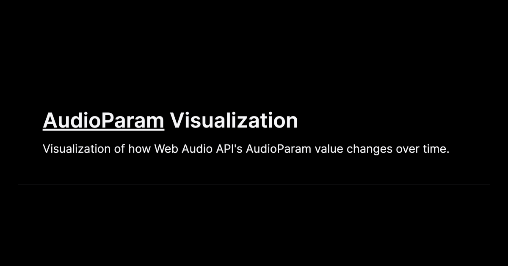

# 🎛️ AudioParam Visualization

Visualization of how Web Audio API's `AudioParam` value changes over time

## See LIVE
### ➡ https://audioparam-visualization.vercel.app




## Development

(1) Install Node.js dependencies

```sh
nvm use
npm install
```

(2) Run the development server:

```bash
npm run dev
```

Open [http://localhost:3000](http://localhost:3000) in browser.
